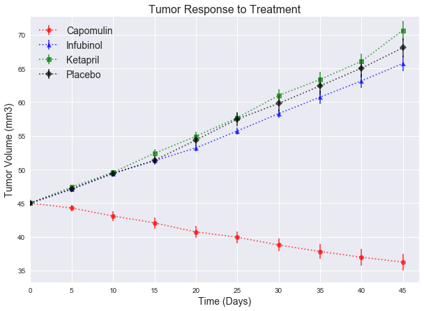
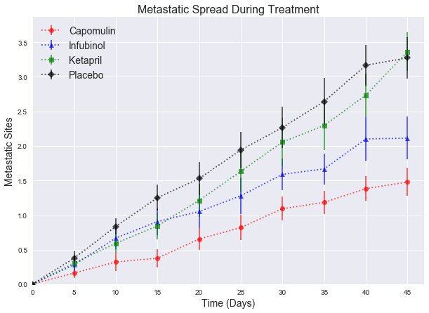
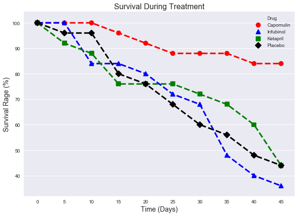
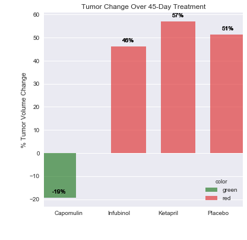

```python

```

# Pymaceuticals - Miriam Berkowitz

### Analysis<br>
1. The drug Capomulin had the most favorable results. Average tumor volumes shrunk, there was lower metastatic spread, and fewer mice died than in the other treatments under analysis, including the placebo. <br>
2. Responses to Infubinol and Ketapril were very similar in average tumor volume change, metastatic spread and mouse survival.<br>
3. The placebo had very similar results to Infubinol and Ketapril in all areas analyzed.


```python
from matplotlib import pyplot as plt
from scipy import stats

import numpy as np
import pandas as pd
from scipy.stats import sem
import seaborn as sns
sns.set(color_codes=True)
```


```python
#read the files
mouse_drug_data = pd.read_csv("mouse_drug_data.csv")
clinicaltrial_data = pd.read_csv("clinicaltrial_data.csv")
```


```python
#merge the tables on Mouse ID
merged_data = pd.merge(mouse_drug_data, clinicaltrial_data, on="Mouse ID")
merged_data.head()
```


<div>
<style>
    .dataframe thead tr:only-child th {
        text-align: right;
    }

    .dataframe thead th {
        text-align: left;
    }

    .dataframe tbody tr th {
        vertical-align: top;
    }
</style>
<table border="1" class="dataframe">
  <thead>
    <tr style="text-align: right;">
      <th></th>
      <th>Mouse ID</th>
      <th>Drug</th>
      <th>Timepoint</th>
      <th>Tumor Volume (mm3)</th>
      <th>Metastatic Sites</th>
    </tr>
  </thead>
  <tbody>
    <tr>
      <th>0</th>
      <td>f234</td>
      <td>Stelasyn</td>
      <td>0</td>
      <td>45.000000</td>
      <td>0</td>
    </tr>
    <tr>
      <th>1</th>
      <td>f234</td>
      <td>Stelasyn</td>
      <td>5</td>
      <td>47.313491</td>
      <td>0</td>
    </tr>
    <tr>
      <th>2</th>
      <td>f234</td>
      <td>Stelasyn</td>
      <td>10</td>
      <td>47.904324</td>
      <td>0</td>
    </tr>
    <tr>
      <th>3</th>
      <td>f234</td>
      <td>Stelasyn</td>
      <td>15</td>
      <td>48.735197</td>
      <td>1</td>
    </tr>
    <tr>
      <th>4</th>
      <td>f234</td>
      <td>Stelasyn</td>
      <td>20</td>
      <td>51.112713</td>
      <td>2</td>
    </tr>
  </tbody>
</table>
</div>


```python
#only keep the data for the drugs that we are analyzing
only_some_drugs = merged_data.loc[(merged_data["Drug"] == "Capomulin") | (merged_data["Drug"] == "Infubinol")
               | (merged_data["Drug"] == "Ketapril")  | (merged_data["Drug"] == "Placebo") , :]
only_some_drugs.head()
```


<div>
<style>
    .dataframe thead tr:only-child th {
        text-align: right;
    }

    .dataframe thead th {
        text-align: left;
    }

    .dataframe tbody tr th {
        vertical-align: top;
    }
</style>
<table border="1" class="dataframe">
  <thead>
    <tr style="text-align: right;">
      <th></th>
      <th>Mouse ID</th>
      <th>Drug</th>
      <th>Timepoint</th>
      <th>Tumor Volume (mm3)</th>
      <th>Metastatic Sites</th>
    </tr>
  </thead>
  <tbody>
    <tr>
      <th>393</th>
      <td>q119</td>
      <td>Ketapril</td>
      <td>0</td>
      <td>45.000000</td>
      <td>0</td>
    </tr>
    <tr>
      <th>394</th>
      <td>q119</td>
      <td>Ketapril</td>
      <td>5</td>
      <td>47.864440</td>
      <td>0</td>
    </tr>
    <tr>
      <th>395</th>
      <td>q119</td>
      <td>Ketapril</td>
      <td>10</td>
      <td>51.236606</td>
      <td>0</td>
    </tr>
    <tr>
      <th>396</th>
      <td>n923</td>
      <td>Ketapril</td>
      <td>0</td>
      <td>45.000000</td>
      <td>0</td>
    </tr>
    <tr>
      <th>397</th>
      <td>n923</td>
      <td>Ketapril</td>
      <td>5</td>
      <td>45.824881</td>
      <td>0</td>
    </tr>
  </tbody>
</table>
</div>


```python
#group the data by drug and timepoint
drug_data = only_some_drugs.groupby(['Drug','Timepoint'])

```

## Tumor Response to Treatment


```python
#compute the mean tumor volume per drug per time period
tumor_vol = pd.DataFrame(drug_data['Tumor Volume (mm3)'].mean())
tumor_vol.rename(columns={'Tumor Volume (mm3)':'mean tumor vol'},inplace = True)

tumor_vol.head()

```


<div>
<style>
    .dataframe thead tr:only-child th {
        text-align: right;
    }

    .dataframe thead th {
        text-align: left;
    }

    .dataframe tbody tr th {
        vertical-align: top;
    }
</style>
<table border="1" class="dataframe">
  <thead>
    <tr style="text-align: right;">
      <th></th>
      <th></th>
      <th>mean tumor vol</th>
    </tr>
    <tr>
      <th>Drug</th>
      <th>Timepoint</th>
      <th></th>
    </tr>
  </thead>
  <tbody>
    <tr>
      <th rowspan="5" valign="top">Capomulin</th>
      <th>0</th>
      <td>45.000000</td>
    </tr>
    <tr>
      <th>5</th>
      <td>44.266086</td>
    </tr>
    <tr>
      <th>10</th>
      <td>43.084291</td>
    </tr>
    <tr>
      <th>15</th>
      <td>42.064317</td>
    </tr>
    <tr>
      <th>20</th>
      <td>40.716325</td>
    </tr>
  </tbody>
</table>
</div>


```python
#compute the standard error for the means
tumor_err = pd.DataFrame(drug_data['Tumor Volume (mm3)'].sem())
tumor_err.rename(columns={'Tumor Volume (mm3)':'sem tumor vol'},inplace = True)
tumor_err.reset_index(inplace=True)
tumor_err.head()

```


<div>
<style>
    .dataframe thead tr:only-child th {
        text-align: right;
    }

    .dataframe thead th {
        text-align: left;
    }

    .dataframe tbody tr th {
        vertical-align: top;
    }
</style>
<table border="1" class="dataframe">
  <thead>
    <tr style="text-align: right;">
      <th></th>
      <th>Drug</th>
      <th>Timepoint</th>
      <th>sem tumor vol</th>
    </tr>
  </thead>
  <tbody>
    <tr>
      <th>0</th>
      <td>Capomulin</td>
      <td>0</td>
      <td>0.000000</td>
    </tr>
    <tr>
      <th>1</th>
      <td>Capomulin</td>
      <td>5</td>
      <td>0.448593</td>
    </tr>
    <tr>
      <th>2</th>
      <td>Capomulin</td>
      <td>10</td>
      <td>0.702684</td>
    </tr>
    <tr>
      <th>3</th>
      <td>Capomulin</td>
      <td>15</td>
      <td>0.838617</td>
    </tr>
    <tr>
      <th>4</th>
      <td>Capomulin</td>
      <td>20</td>
      <td>0.909731</td>
    </tr>
  </tbody>
</table>
</div>


```python
#reset the index
tumor_vol.reset_index(inplace=True)
```


```python
#pivot to display all the mean tumor volume for each drug over time
pivot_tumor_vol = tumor_vol.pivot(index='Timepoint', columns='Drug', values='mean tumor vol')
pivot_tumor_vol.reset_index(inplace=True)
pivot_tumor_vol
```


<div>
<style>
    .dataframe thead tr:only-child th {
        text-align: right;
    }

    .dataframe thead th {
        text-align: left;
    }

    .dataframe tbody tr th {
        vertical-align: top;
    }
</style>
<table border="1" class="dataframe">
  <thead>
    <tr style="text-align: right;">
      <th>Drug</th>
      <th>Timepoint</th>
      <th>Capomulin</th>
      <th>Infubinol</th>
      <th>Ketapril</th>
      <th>Placebo</th>
    </tr>
  </thead>
  <tbody>
    <tr>
      <th>0</th>
      <td>0</td>
      <td>45.000000</td>
      <td>45.000000</td>
      <td>45.000000</td>
      <td>45.000000</td>
    </tr>
    <tr>
      <th>1</th>
      <td>5</td>
      <td>44.266086</td>
      <td>47.062001</td>
      <td>47.389175</td>
      <td>47.125589</td>
    </tr>
    <tr>
      <th>2</th>
      <td>10</td>
      <td>43.084291</td>
      <td>49.403909</td>
      <td>49.582269</td>
      <td>49.423329</td>
    </tr>
    <tr>
      <th>3</th>
      <td>15</td>
      <td>42.064317</td>
      <td>51.296397</td>
      <td>52.399974</td>
      <td>51.359742</td>
    </tr>
    <tr>
      <th>4</th>
      <td>20</td>
      <td>40.716325</td>
      <td>53.197691</td>
      <td>54.920935</td>
      <td>54.364417</td>
    </tr>
    <tr>
      <th>5</th>
      <td>25</td>
      <td>39.939528</td>
      <td>55.715252</td>
      <td>57.678982</td>
      <td>57.482574</td>
    </tr>
    <tr>
      <th>6</th>
      <td>30</td>
      <td>38.769339</td>
      <td>58.299397</td>
      <td>60.994507</td>
      <td>59.809063</td>
    </tr>
    <tr>
      <th>7</th>
      <td>35</td>
      <td>37.816839</td>
      <td>60.742461</td>
      <td>63.371686</td>
      <td>62.420615</td>
    </tr>
    <tr>
      <th>8</th>
      <td>40</td>
      <td>36.958001</td>
      <td>63.162824</td>
      <td>66.068580</td>
      <td>65.052675</td>
    </tr>
    <tr>
      <th>9</th>
      <td>45</td>
      <td>36.236114</td>
      <td>65.755562</td>
      <td>70.662958</td>
      <td>68.084082</td>
    </tr>
  </tbody>
</table>
</div>


```python
# set up lists for all the scatter plots
drugs = ['Capomulin','Infubinol', 'Ketapril','Placebo']
colors = ['red','blue','green','black']
formats = ['o','^','s','D']

```


```python
#plot tumor vol using matplotlib, including error bars

fig, ax = plt.subplots(figsize=(10,7))

#loop through the drugs to include on the plot
for i in range(0,len(drugs)):

   
    #x-axis is timepoint for the particular drug
    drug_data_to_plot = tumor_vol.loc[tumor_vol['Drug'] == drugs[i],:]
    x_axis = drug_data_to_plot['Timepoint']
      
    #y-axis is tumor volume
    y_axis = drug_data_to_plot['mean tumor vol'] 

    #errors is the standard error
    err_data_to_plot = tumor_err.loc[tumor_err['Drug'] == drugs[i],:]
    errors = err_data_to_plot['sem tumor vol']
   
   
    #plot the data and the error
    ax.errorbar(x_axis, y_axis, yerr=errors, fmt=formats[i], marker = formats[i], color=colors[i],
            alpha=0.7, label=drugs[i],ls='dotted')
           
    ax.set_xlabel("Time (Days)",fontsize=14)
    ax.set_ylabel("Tumor Volume (mm3)",fontsize=14)
    ax.set_title("Tumor Response to Treatment",fontsize=16)
    #add the legend
    ax.legend(loc="best", fontsize=14,fancybox=True)
    
    plt.xticks(x_axis, x_axis)
    ax.set_xlim(0, x_axis.max() + 2)
    ax.set_ylim(tumor_vol['mean tumor vol'].min()-3, tumor_vol['mean tumor vol'].max()+2)
        
#end loop

plt.show()
```





## Metastatic Response to Treatment


```python
#compute the mean metastatic sites per drug per time period
metas_sites = pd.DataFrame(drug_data['Metastatic Sites'].mean())
metas_sites.rename(columns={'Metastatic Sites':'Mean Metastatic Sites'},inplace = True)
metas_sites.reset_index(inplace=True)

```


```python
#compute the error from the means
metas_err = pd.DataFrame(drug_data['Metastatic Sites'].sem())
metas_err.rename(columns={'Metastatic Sites':'sem metas sites'},inplace = True)
metas_err.reset_index(inplace=True)

```


```python
fig, ax = plt.subplots(figsize=(10,7))

#loop through the drugs to include on the plot
for i in range(0,len(drugs)):

   
    #x-axis is timepoint for the particular drug
    drug_data_to_plot = metas_sites.loc[metas_sites['Drug'] == drugs[i],:]
    x_axis = drug_data_to_plot['Timepoint']
      
    #y-axis is metastatic sites
    y_axis = drug_data_to_plot['Mean Metastatic Sites'] 

    #errors is the standard error
    err_data_to_plot = metas_err.loc[metas_err['Drug'] == drugs[i],:]
    errors = err_data_to_plot['sem metas sites']
   
   
    #plot the data and the error
    ax.errorbar(x_axis, y_axis, yerr=errors, fmt=formats[i], marker = formats[i], color=colors[i],
            alpha=0.7, label=drugs[i],ls='dotted')
        
    ax.set_xlabel("Time (Days)",fontsize=14)
    ax.set_ylabel("Metastatic Sites",fontsize=14)
    ax.set_title("Metastatic Spread During Treatment",fontsize=16)
    #add the legend
    ax.legend(loc="best", fontsize=14,fancybox=True)
    
    plt.xticks(x_axis, x_axis)
    ax.set_xlim(0, x_axis.max() + 2)
    ax.set_ylim(0.0, metas_sites['Mean Metastatic Sites'].max()+0.5)
        
#end loop

plt.show()


```





## Survival Rates


```python
#compute the mouse count at each time period
#group the data by drug and timepoint
time_data = only_some_drugs.groupby(['Timepoint','Drug'])
time_data.head()
time_data['Mouse ID'].count()

survival = pd.DataFrame(time_data['Mouse ID'].count())

survival.rename(columns={'Mouse ID':'mouse_count'},inplace = True)
survival.reset_index(inplace=True)
survival.head()

```


<div>
<style>
    .dataframe thead tr:only-child th {
        text-align: right;
    }

    .dataframe thead th {
        text-align: left;
    }

    .dataframe tbody tr th {
        vertical-align: top;
    }
</style>
<table border="1" class="dataframe">
  <thead>
    <tr style="text-align: right;">
      <th></th>
      <th>Timepoint</th>
      <th>Drug</th>
      <th>mouse_count</th>
    </tr>
  </thead>
  <tbody>
    <tr>
      <th>0</th>
      <td>0</td>
      <td>Capomulin</td>
      <td>25</td>
    </tr>
    <tr>
      <th>1</th>
      <td>0</td>
      <td>Infubinol</td>
      <td>25</td>
    </tr>
    <tr>
      <th>2</th>
      <td>0</td>
      <td>Ketapril</td>
      <td>25</td>
    </tr>
    <tr>
      <th>3</th>
      <td>0</td>
      <td>Placebo</td>
      <td>25</td>
    </tr>
    <tr>
      <th>4</th>
      <td>5</td>
      <td>Capomulin</td>
      <td>25</td>
    </tr>
  </tbody>
</table>
</div>


```python
#resort by drug and time
survival_drug = survival.sort_values(['Drug','Timepoint'])
survival_drug.head()
```


<div>
<style>
    .dataframe thead tr:only-child th {
        text-align: right;
    }

    .dataframe thead th {
        text-align: left;
    }

    .dataframe tbody tr th {
        vertical-align: top;
    }
</style>
<table border="1" class="dataframe">
  <thead>
    <tr style="text-align: right;">
      <th></th>
      <th>Timepoint</th>
      <th>Drug</th>
      <th>mouse_count</th>
    </tr>
  </thead>
  <tbody>
    <tr>
      <th>0</th>
      <td>0</td>
      <td>Capomulin</td>
      <td>25</td>
    </tr>
    <tr>
      <th>4</th>
      <td>5</td>
      <td>Capomulin</td>
      <td>25</td>
    </tr>
    <tr>
      <th>8</th>
      <td>10</td>
      <td>Capomulin</td>
      <td>25</td>
    </tr>
    <tr>
      <th>12</th>
      <td>15</td>
      <td>Capomulin</td>
      <td>24</td>
    </tr>
    <tr>
      <th>16</th>
      <td>20</td>
      <td>Capomulin</td>
      <td>23</td>
    </tr>
  </tbody>
</table>
</div>


```python
#pivot to display mouse counts for each drug over time
pivot_mouse = survival_drug.pivot(index='Timepoint', columns='Drug', values='mouse_count')
pivot_mouse
```


<div>
<style>
    .dataframe thead tr:only-child th {
        text-align: right;
    }

    .dataframe thead th {
        text-align: left;
    }

    .dataframe tbody tr th {
        vertical-align: top;
    }
</style>
<table border="1" class="dataframe">
  <thead>
    <tr style="text-align: right;">
      <th>Drug</th>
      <th>Capomulin</th>
      <th>Infubinol</th>
      <th>Ketapril</th>
      <th>Placebo</th>
    </tr>
    <tr>
      <th>Timepoint</th>
      <th></th>
      <th></th>
      <th></th>
      <th></th>
    </tr>
  </thead>
  <tbody>
    <tr>
      <th>0</th>
      <td>25</td>
      <td>25</td>
      <td>25</td>
      <td>25</td>
    </tr>
    <tr>
      <th>5</th>
      <td>25</td>
      <td>25</td>
      <td>23</td>
      <td>24</td>
    </tr>
    <tr>
      <th>10</th>
      <td>25</td>
      <td>21</td>
      <td>22</td>
      <td>24</td>
    </tr>
    <tr>
      <th>15</th>
      <td>24</td>
      <td>21</td>
      <td>19</td>
      <td>20</td>
    </tr>
    <tr>
      <th>20</th>
      <td>23</td>
      <td>20</td>
      <td>19</td>
      <td>19</td>
    </tr>
    <tr>
      <th>25</th>
      <td>22</td>
      <td>18</td>
      <td>19</td>
      <td>17</td>
    </tr>
    <tr>
      <th>30</th>
      <td>22</td>
      <td>17</td>
      <td>18</td>
      <td>15</td>
    </tr>
    <tr>
      <th>35</th>
      <td>22</td>
      <td>12</td>
      <td>17</td>
      <td>14</td>
    </tr>
    <tr>
      <th>40</th>
      <td>21</td>
      <td>10</td>
      <td>15</td>
      <td>12</td>
    </tr>
    <tr>
      <th>45</th>
      <td>21</td>
      <td>9</td>
      <td>11</td>
      <td>11</td>
    </tr>
  </tbody>
</table>
</div>


```python
#get drug and number of mice at timepoint 0
orig_mice = survival_drug.loc[(survival_drug["Timepoint"] == 0),:]
orig_mice.rename(columns={'mouse_count':'total_mice'},inplace = True)
del orig_mice['Timepoint']

orig_mice
```

    /Users/miriamberkowitz/anaconda/lib/python3.6/site-packages/pandas/core/frame.py:2844: SettingWithCopyWarning: 
    A value is trying to be set on a copy of a slice from a DataFrame
    
    See the caveats in the documentation: http://pandas.pydata.org/pandas-docs/stable/indexing.html#indexing-view-versus-copy
      **kwargs)


<div>
<style>
    .dataframe thead tr:only-child th {
        text-align: right;
    }

    .dataframe thead th {
        text-align: left;
    }

    .dataframe tbody tr th {
        vertical-align: top;
    }
</style>
<table border="1" class="dataframe">
  <thead>
    <tr style="text-align: right;">
      <th></th>
      <th>Drug</th>
      <th>total_mice</th>
    </tr>
  </thead>
  <tbody>
    <tr>
      <th>0</th>
      <td>Capomulin</td>
      <td>25</td>
    </tr>
    <tr>
      <th>1</th>
      <td>Infubinol</td>
      <td>25</td>
    </tr>
    <tr>
      <th>2</th>
      <td>Ketapril</td>
      <td>25</td>
    </tr>
    <tr>
      <th>3</th>
      <td>Placebo</td>
      <td>25</td>
    </tr>
  </tbody>
</table>
</div>


```python
#merge the table with the original total mouse count with survival_drug
merge_survival = pd.merge(survival_drug, orig_mice, on="Drug")
merge_survival.head()
```


<div>
<style>
    .dataframe thead tr:only-child th {
        text-align: right;
    }

    .dataframe thead th {
        text-align: left;
    }

    .dataframe tbody tr th {
        vertical-align: top;
    }
</style>
<table border="1" class="dataframe">
  <thead>
    <tr style="text-align: right;">
      <th></th>
      <th>Timepoint</th>
      <th>Drug</th>
      <th>mouse_count</th>
      <th>total_mice</th>
    </tr>
  </thead>
  <tbody>
    <tr>
      <th>0</th>
      <td>0</td>
      <td>Capomulin</td>
      <td>25</td>
      <td>25</td>
    </tr>
    <tr>
      <th>1</th>
      <td>5</td>
      <td>Capomulin</td>
      <td>25</td>
      <td>25</td>
    </tr>
    <tr>
      <th>2</th>
      <td>10</td>
      <td>Capomulin</td>
      <td>25</td>
      <td>25</td>
    </tr>
    <tr>
      <th>3</th>
      <td>15</td>
      <td>Capomulin</td>
      <td>24</td>
      <td>25</td>
    </tr>
    <tr>
      <th>4</th>
      <td>20</td>
      <td>Capomulin</td>
      <td>23</td>
      <td>25</td>
    </tr>
  </tbody>
</table>
</div>


```python
#store the percentage of mice still alive
merge_survival["percent_alive"] = merge_survival['mouse_count'] / merge_survival['total_mice'] * 100

#only keep the drugs we need to display
merge_survival.head()

```


<div>
<style>
    .dataframe thead tr:only-child th {
        text-align: right;
    }

    .dataframe thead th {
        text-align: left;
    }

    .dataframe tbody tr th {
        vertical-align: top;
    }
</style>
<table border="1" class="dataframe">
  <thead>
    <tr style="text-align: right;">
      <th></th>
      <th>Timepoint</th>
      <th>Drug</th>
      <th>mouse_count</th>
      <th>total_mice</th>
      <th>percent_alive</th>
    </tr>
  </thead>
  <tbody>
    <tr>
      <th>0</th>
      <td>0</td>
      <td>Capomulin</td>
      <td>25</td>
      <td>25</td>
      <td>100.0</td>
    </tr>
    <tr>
      <th>1</th>
      <td>5</td>
      <td>Capomulin</td>
      <td>25</td>
      <td>25</td>
      <td>100.0</td>
    </tr>
    <tr>
      <th>2</th>
      <td>10</td>
      <td>Capomulin</td>
      <td>25</td>
      <td>25</td>
      <td>100.0</td>
    </tr>
    <tr>
      <th>3</th>
      <td>15</td>
      <td>Capomulin</td>
      <td>24</td>
      <td>25</td>
      <td>96.0</td>
    </tr>
    <tr>
      <th>4</th>
      <td>20</td>
      <td>Capomulin</td>
      <td>23</td>
      <td>25</td>
      <td>92.0</td>
    </tr>
  </tbody>
</table>
</div>


```python
#PLOT Survival Using SEABORN

fig, ax = plt.subplots(figsize=(10,7))
g = sns.pointplot(x="Timepoint", y="percent_alive", hue=merge_survival['Drug'], data=merge_survival, markers=formats, palette=colors, linestyles="--")


g.figure.set_size_inches(10,7)
ax.set_xlabel("Time (Days)",fontsize=14)
ax.set_ylabel("Survival Rage (%)",fontsize=14)
ax.set_title("Survival During Treatment",fontsize=16)
plt.show()
```





## Total Percentage of Tumor Volume Change 


```python
min_timepoint = clinicaltrial_data['Timepoint'].min()
max_timepoint = clinicaltrial_data['Timepoint'].max()
```


```python
tumor_diffs = [(pivot_tumor_vol.iloc[9,:] - pivot_tumor_vol.iloc[0,:]) / pivot_tumor_vol.iloc[0,:] * 100]
tumor_diffs
```


    [Drug
     Timepoint          inf
     Capomulin   -19.475303
     Infubinol    46.123472
     Ketapril     57.028795
     Placebo      51.297960
     dtype: float64]


```python
# #put tumor_diffs into a dataframe
# diffs = pd.DataFrame(tumor_diffs)
# diffs
```


```python
# diffs_t = diffs.transpose()
# diffs_t.reset_index(inplace=True)

```


```python
#tumor differences data frame
final_product = pd.DataFrame({"drugs":tumor_diffs[0].index, "values":tumor_diffs[0].values})
final_product
```


<div>
<style>
    .dataframe thead tr:only-child th {
        text-align: right;
    }

    .dataframe thead th {
        text-align: left;
    }

    .dataframe tbody tr th {
        vertical-align: top;
    }
</style>
<table border="1" class="dataframe">
  <thead>
    <tr style="text-align: right;">
      <th></th>
      <th>drugs</th>
      <th>values</th>
    </tr>
  </thead>
  <tbody>
    <tr>
      <th>0</th>
      <td>Timepoint</td>
      <td>inf</td>
    </tr>
    <tr>
      <th>1</th>
      <td>Capomulin</td>
      <td>-19.475303</td>
    </tr>
    <tr>
      <th>2</th>
      <td>Infubinol</td>
      <td>46.123472</td>
    </tr>
    <tr>
      <th>3</th>
      <td>Ketapril</td>
      <td>57.028795</td>
    </tr>
    <tr>
      <th>4</th>
      <td>Placebo</td>
      <td>51.297960</td>
    </tr>
  </tbody>
</table>
</div>


```python
#remove 0th row 
final_product.drop([0],inplace=True)
final_product
```


<div>
<style>
    .dataframe thead tr:only-child th {
        text-align: right;
    }

    .dataframe thead th {
        text-align: left;
    }

    .dataframe tbody tr th {
        vertical-align: top;
    }
</style>
<table border="1" class="dataframe">
  <thead>
    <tr style="text-align: right;">
      <th></th>
      <th>drugs</th>
      <th>values</th>
    </tr>
  </thead>
  <tbody>
    <tr>
      <th>1</th>
      <td>Capomulin</td>
      <td>-19.475303</td>
    </tr>
    <tr>
      <th>2</th>
      <td>Infubinol</td>
      <td>46.123472</td>
    </tr>
    <tr>
      <th>3</th>
      <td>Ketapril</td>
      <td>57.028795</td>
    </tr>
    <tr>
      <th>4</th>
      <td>Placebo</td>
      <td>51.297960</td>
    </tr>
  </tbody>
</table>
</div>


```python
#add color for chart
final_product['color'] = np.where(final_product['values']>1.0, 'red', 'green')
final_product
```


<div>
<style>
    .dataframe thead tr:only-child th {
        text-align: right;
    }

    .dataframe thead th {
        text-align: left;
    }

    .dataframe tbody tr th {
        vertical-align: top;
    }
</style>
<table border="1" class="dataframe">
  <thead>
    <tr style="text-align: right;">
      <th></th>
      <th>drugs</th>
      <th>values</th>
      <th>color</th>
    </tr>
  </thead>
  <tbody>
    <tr>
      <th>1</th>
      <td>Capomulin</td>
      <td>-19.475303</td>
      <td>green</td>
    </tr>
    <tr>
      <th>2</th>
      <td>Infubinol</td>
      <td>46.123472</td>
      <td>red</td>
    </tr>
    <tr>
      <th>3</th>
      <td>Ketapril</td>
      <td>57.028795</td>
      <td>red</td>
    </tr>
    <tr>
      <th>4</th>
      <td>Placebo</td>
      <td>51.297960</td>
      <td>red</td>
    </tr>
  </tbody>
</table>
</div>


```python
#use Seaborn to plot the bar chart

#function to make the bar width wider
def change_width(ax, new_value) :
    for patch in ax.patches :
        current_width = patch.get_width()
        diff = current_width - new_value

        # change the bar width
        patch.set_width(new_value)

        # recenter the bar
        patch.set_x(patch.get_x() + diff * .5)
        
#use red and green, set in the data     
custom_palette = final_product['color']
fig, ax = plt.subplots()
plt.title("Tumor Change Over 45-Day Treatment")

g = sns.barplot(x="drugs", y="values", data=final_product, hue = 'color', palette=custom_palette,alpha=0.6)
g.figure.set_size_inches(6,6)

#make the bar width wider
change_width(ax, 0.7)

#function to annotate the bars with the percentage
def annotateBars(row, ax=ax): 
    for p in ax.patches:
         ax.annotate('%.0f%%' % p.get_height(), (p.get_x() + p.get_width() / 2., p.get_height()),
             ha='center', va='center', fontsize=10, color='black', xytext=(0, 10),
             textcoords='offset points')  

#add the annotation to the plot
plot = final_product.apply(annotateBars, ax=ax, axis=1)

plt.ylabel("% Tumor Volume Change")
plt.xlabel("")

plt.show()
```





```python

```
